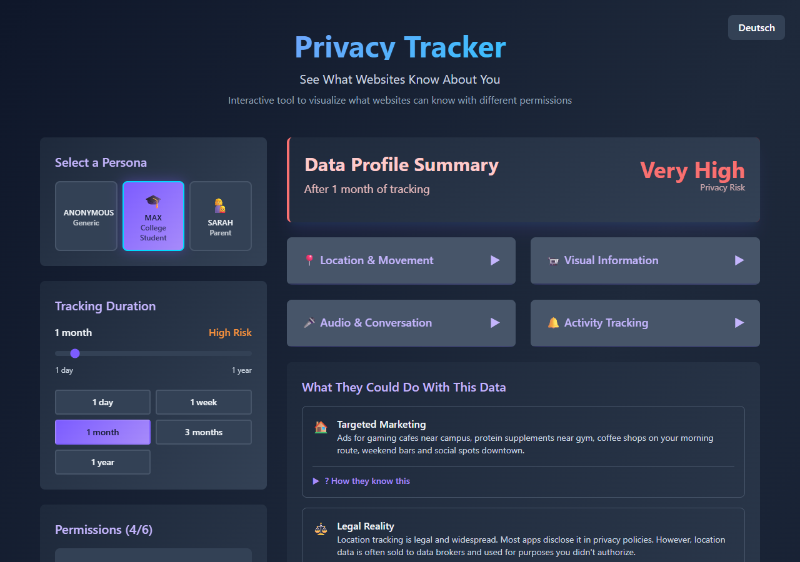

# Privacy Tracker

An interactive web app that shows what a website or app could learn about you from the permissions you grant, and how that picture grows the longer it tracks you.

**Live demo:** https://hafsa993.github.io/SecurityMonitor/



## Features

- **Permission toggles:** location, camera, microphone, clipboard, contacts and notifications
- **Tracking duration** from 1 day to 1 year, with a combined privacy risk level
- **Personas:** see the profile of a generic user, Max (college student) or Sarah (parent), each with realistic inferences and example ads
- **"How they know this"** breakdowns linking each inference to the permissions that reveal it, including combinations (e.g. location + microphone)
- **Legal context and protection tips** for each permission
- **English and German**, switchable at any time; the language and your selections are remembered in the browser

Everything runs in the browser. No data leaves your device.

## Tech stack

Next.js 16 (App Router) · React 18 · Tailwind CSS · Jest + Testing Library

## Getting started

Requires Node.js 20.9 or newer.

```bash
cd app
npm install
npm run dev
```

Then open http://localhost:3000.

| Command (in `app/`) | Description |
|---|---|
| `npm run dev` | Start the development server |
| `npm run build` / `npm start` | Production build and server |
| `npm test` | Run the test suite |
| `npm run test:coverage` | Run tests with a coverage report |

### Docker

```bash
docker compose up --build
```

The app is served on http://localhost:3000.

### Deployment

Every push to `main` runs the tests and, if they pass, publishes a static export of the app to GitHub Pages ([`.github/workflows/ci.yml`](.github/workflows/ci.yml)).

## Project structure

```
app/src/
├── app/            # Next.js layout, page and global styles
├── components/     # PermissionTracker, ProfileCard, DurationSlider, PersonaSelector, ...
├── context/        # LanguageContext (translation function + language state)
├── i18n/           # en.json, de.json
├── utils/          # Profile generation: configs, persona data, section builders
└── __tests__/      # Unit, component and integration tests
```

See [docs/ARCHITECTURE.md](docs/ARCHITECTURE.md) for how the profile is built, how translations work and how to add personas or permissions.

## Ideas for the future

- Compare two permission scenarios side by side
- Share a scenario via URL
- More personas and languages

## License

[MIT](LICENSE)
